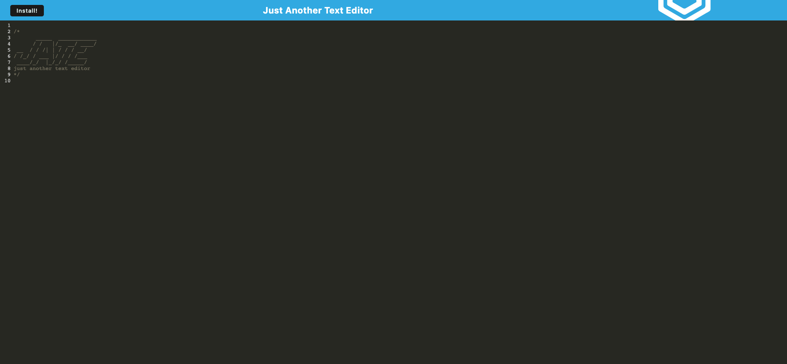

# Text Editor PWA

## Description

This is a text editor and progressive web app that highlights JavaScript syntax

## Table of Contents

- [Text Editor PWA](#text-editor-pwa)
  - [Description](#description)
  - [Table of Contents](#table-of-contents)
  - [Installation](#installation)
  - [Usage](#usage)
  - [Credits](#credits)
  - [License](#license)
  - [Features](#features)
  - [How to Contribute](#how-to-contribute)
  - [Tests](#tests)
  - [Questions](#questions)

## Installation

There is an install button as well as the install button in the URL bar.

## Usage

This can be used to write down code sections that need to be retained.

.

## Credits

Webpack: https://webpack.js.org/
WorkBox: https://developer.chrome.com/docs/workbox/

## License

This project is under the .

## Features

This can be installed on your local device and it retains your notes for future use.

## How to Contribute

Github

## Tests

Try typing code, closing and reopening, installing, etc.

## Questions

Reach me through my GitHub-rtcottle here: https://github.com/rtcottle
